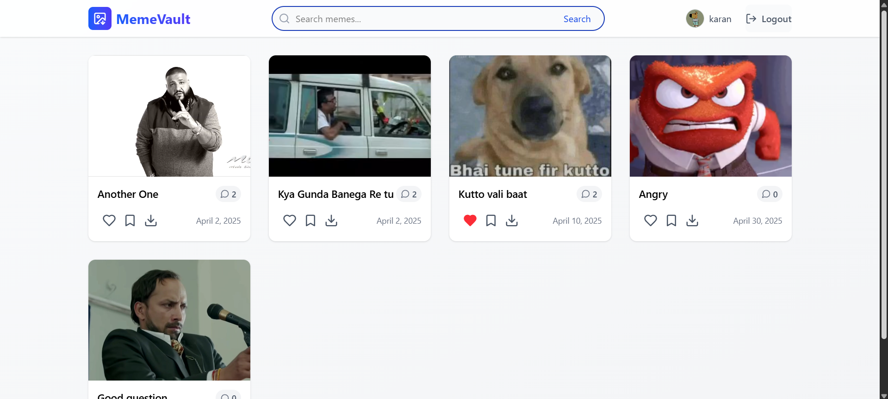

# 🤣 Meme Vault

**Meme Vault** is the ultimate meme-sharing platform where humor meets technology. Built with a modern stack and designed for seamless user experience, Meme Vault lets you explore, share, and interact with memes—while keeping advanced features gated behind secure authentication.

> A day without a meme is a day wasted.

---

## 🌟 Key Features

- 🔓 **Public Meme Sharing** – Anyone can view a shared meme, even without logging in.
- 🔐 **Auth-Guarded Interactions** – Users must log in to like, comment, save, or explore more memes.
- 📤 **Meme Uploading** – Upload your favorite memes and share them with the world.
- ❤️ **Like & Save** – Save your favorite memes and express your love.
- 💬 **Commenting System** – Start meme-worthy conversations.
- 📎 **Sharable Links** – Seamlessly share memes across platforms.
- ⚡ **High Performance** – Caching with Redis, optimized APIs with Spring Boot, and blazing-fast frontend with Vite.

---

## 🔗 How Meme Sharing Works

When a user shares a meme:

- The recipient receives a **direct link** (e.g., `/meme/:id`) and can view the meme **without being logged in**.
- Any actions beyond viewing—such as **liking**, **commenting**, **saving**, or **browsing more memes**—require the recipient to **log in first**.
- Post-login, users are redirected **back to the originally shared meme** for a seamless experience.

This creates a frictionless invite mechanism while preserving the value of signing up.

---

## 🛠️ Tech Stack

| Layer            | Technology                     |
|------------------|--------------------------------|
| **Frontend**     | React + TypeScript + Vite      |
| **Backend**      | Java + Spring Boot             |
| **Database**     | MongoDB                        |
| **Authentication** | JWT (JSON Web Tokens)       |
| **Caching**      | Redis                          |
| **Containerization** | Docker                    |

---

## 📸 Screenshots

### 🔒 Logged-In View


---

## 🧩 Architecture Overview

```plaintext
                     +----------------------+
                     |     Frontend         |
                     |  React + Vite + TS   |
                     +----------+-----------+
                                |
                                v
                     +----------------------+
                     |     Backend API      |
                     |   Java + Spring Boot |
                     +----------+-----------+
                                |
               +-------------------------------+
               |                               |
               v                               v
        +-------------+                +-------------+
        |   MongoDB   |                |    Redis    |
        | (Database)  |                | (Caching)   |
        +-------------+                +-------------+

        🔐 Secured with JWT     🐳 Deployed using Docker

```

## ✨ Future Enhancements

- 🔎 Advanced search & meme tagging  
- 🧠 AI-powered meme suggestions  
- 🏆 Meme leaderboard & weekly highlights  
- 📈 Analytics dashboard for meme performance  
- 🌐 Multi-language support  
- 📲 PWA & mobile app version  


## 👨‍💻 Author

**Karan Pareek**  
📧 softwaredev1112@gmail.com  
🌐 [LinkedIn](http://www.linkedin.com/in/karan-pareek-337067270)  

---

> 💡 _“Memes are the DNA of our culture — Meme Vault preserves them forever.”_
